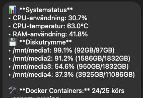

# SysMon2 - System & Docker Monitoring Bot

**SysMon2** is a Python-based monitoring bot that keeps track of system resources, disk usage, and Docker container statuses. It sends alerts to a Telegram chat when thresholds are exceeded, allowing you to monitor your server remotely.

---

## Features

- **CPU Monitoring:** Alerts when CPU usage is above a configurable threshold.
- **RAM Monitoring:** Alerts when RAM usage exceeds the set limit.
- **Disk Monitoring:** Monitors specified mount points and alerts when disk usage is high.
- **CPU Temperature:** Alerts if CPU temperature goes above a defined threshold.
- **Docker Monitoring:** Checks the status of all Docker containers and reports running vs total containers.
- **Telegram Alerts:** Sends real-time alerts to your Telegram bot for easy remote monitoring.
- **Acknowledgment Command:** Allows acknowledging alerts via Telegram to avoid repeated notifications.
- **Status Command:** Get a full system status report via Telegram on demand.

---


## Installation

1. Clone this repository
2. Install dependencies (pip install -r requirements.txt)
3. Enter your chatID and auth token for telegram and adjust mount points. 

## Configuration Example

You can adjust the system thresholds, mount points, and check interval in `sysmon2.py`:

```python
# System thresholds
CPU_THRESHOLD  = 80  # CPU usage percentage (%)
RAM_THRESHOLD  = 90  # RAM usage percentage (%)
DISK_THRESHOLD = 95  # Disk usage percentage (%)
TEMP_THRESHOLD = 70  # CPU temperature in Celsius (°C)

# Mount points to monitor (add or remove as needed)
MOUNT_POINTS = [
    "/mnt/mount1",
    "/mnt/mount2",
    "/mnt/mount3",
    "/mnt/mount4"
]

# Interval in seconds to check system status
CHECK_INTERVAL = 60
```
## Optional: Run as systemd Service

```ini
[Unit]
Description=System & Docker Monitoring Bot
After=network.target docker.service
Requires=docker.service

[Service]
Type=simple
ExecStart=/usr/bin/python3 /home/sysmon.py
Restart=on-failure
RestartSec=5

[Install]
WantedBy=multi-user.target
```
```bash
sudo systemctl daemon-reload
sudo systemctl enable sysmon.service
sudo systemctl start sysmon.service
```
## Usage

Once SysMon2 is running (either manually or as a systemd service), you can interact with it directly via Telegram. The bot responds to simple commands that help you monitor and manage your server.

### Telegram Commands

- **`/status`**  
  Get a real-time snapshot of your server's current status. The bot will reply with:
  - CPU usage (%) and if it's above the threshold  
  - RAM usage (%) and if it's above the threshold  
  - Disk usage of monitored mount points (%)  
  - CPU temperature (°C)  
  - Docker container status (running vs total containers)  

- **`/ack`**  
  Acknowledge any active alarms. This prevents the bot from repeatedly sending notifications for the same issue until a new alert is triggered.

### What to Expect

- **Alerts:**  
  If any of your system thresholds are exceeded (CPU, RAM, Disk, Temp, Docker status), the bot sends an immediate Telegram alert with details. Example:

- **Periodic Status:**  
SysMon2 checks your system at the interval specified in `CHECK_INTERVAL` (default 60 seconds). It only sends notifications when something exceeds the thresholds, keeping your chat clutter-free.


Once an alert is acknowledged via `/ack`, SysMon2 will suppress further notifications for that specific issue until the next check detects a new threshold breach.

### Example Workflow

1. You notice a Telegram alert for high RAM usage.  
2. Run `/status` to see a detailed breakdown of all monitored metrics.  
3. After investigating and fixing the issue, run `/ack` to acknowledge the alert.  
4. SysMon2 continues monitoring in the background and will notify you only if a new issue occurs.

## Screenshot (Telegram Alerts)




